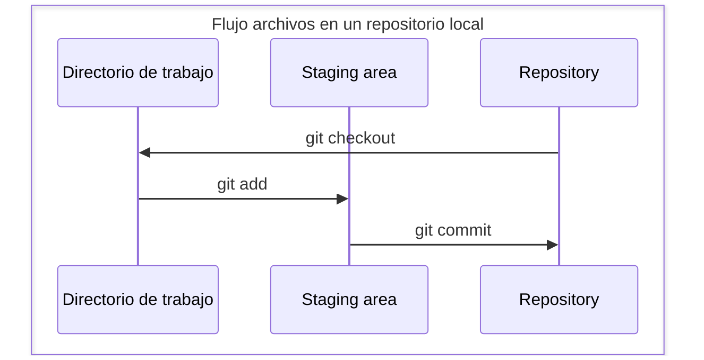

<div align="center">
<picture>
    <source srcset="https://imgur.com/5bYAzsb.png" media="(prefers-color-scheme: dark)">
    <source srcset="https://imgur.com/Os03JoE.png" media="(prefers-color-scheme: light)">
    
</picture>

<h3>Curso de Fundamentos de Robótica Móvil</h3>

<h1>Herramientas de Software</h1>

<h2>Uso de git y github</h2>

<h4>Pedro F. Cárdenas<br>
    Ricardo Ramírez<br>
    Juan S. Daleman</h4>

<h6>Universidad Nacional de Colombia<br>
    Facultad de Ingeniería<br>
    Departamento de Ingeniería Mecánica y Mecatrónica<br>
    Bogotá, Colombia<br>
    2025</h6>
</div>

<details>
    <summary>🗂️ Tabla de Contenido</summary>

<!-- TOC -->
- [1. 📖 Introducción](#1--introducción)
  - [1.1. 🤝🔄💻 ¿Qué es git?](#11--qué-es-git)
  - [1.2. 📦🌐👩‍💻 ¿Qué es github?](#12--qué-es-github)
- [2. 🧰 Herramientas Necesarias](#2--herramientas-necesarias)
  - [2.1. 🔭🛠️ Equipos](#21-️-equipos)
  - [2.2. 🖥️💾 Software](#22-️-software)
- [3. 🔧➡️🚀 Procedimiento](#3-️-procedimiento)
  - [3.1. 🪄📝 Inicializar un repositorio](#31--inicializar-un-repositorio)
  - [3.2. 🕵️‍♂️📝 Monitoreo de un archivo](#32-️️-monitoreo-de-un-archivo)
  - [3.3. 🧐📄 Viendo los cambios de un archivo](#33--viendo-los-cambios-de-un-archivo)
  - [3.4. 🛠️🐙 Usando GitHub](#34-️-usando-github)
  - [3.5. 🧠🔀📂 Haciendo un merge](#35--haciendo-un-merge)
  - [3.6. 🌿🛠️ Uso de ramas](#36-️-uso-de-ramas)
- [4. 🦾⚔️ Retos](#4-️-retos)
- [5. 👀🔀🦾 Flujo de trabajo con git y github](#5--flujo-de-trabajo-con-git-y-github)
  - [5.1. 📋🐙 Partes del menú principal de un repositorio en GitHub](#51--partes-del-menú-principal-de-un-repositorio-en-github)
- [6. ⌨️📄 Comandos de git](#6-️-comandos-de-git)
- [7. 💡🌟🤝 Recomendaciones](#7--recomendaciones)
  - [7.1. 🐛🐞🚧 Issues](#71--issues)
    - [7.1.1. 🧐🤔 ¿Para qué sirven los issues?](#711--para-qué-sirven-los-issues)
    - [7.1.2. ✍️🧱  ¿Comó crear un issue?](#712-️--comó-crear-un-issue)
  - [7.2. 🤝💬🌐 Participación y comunidad](#72--participación-y-comunidad)
  - [7.3. 🎥🖼️🎤 Uso de contenido multimedia](#73-️-uso-de-contenido-multimedia)
    - [7.3.1. 🎥📹🎬 Videos y GIFs](#731--videos-y-gifs)
    - [7.3.2. 📷🖼️ Imágenes](#732-️-imágenes)
    - [7.3.3. 🗣️💬🎤 Audios](#733-️-audios)
  - [7.4. ⚙️🔐🔌 Configuracion de conexión ssh](#74-️-configuracion-de-conexión-ssh)
  - [7.5. 📌✉️ Convenciones comunes para mensajes de commit en GitHub](#75-️-convenciones-comunes-para-mensajes-de-commit-en-github)
  - [7.6. 📌✉️🔀 Convenciones comunes para mensajes de merge en git y github](#76-️-convenciones-comunes-para-mensajes-de-merge-en-git-y-github)
</details>

---

<h1> 📥🔄🐙💻 El uso de git y github </h1>

## 1. 📖 Introducción

### 1.1. 🤝🔄💻 ¿Qué es git?

Git es un sistema de control de versiones distribuido que permite registrar los cambios realizados en archivos a lo largo del tiempo, facilitando la colaboración entre múltiples desarrolladores. El término "git", en inglés informal británico, puede significar algo así como "tipo tonto" o "idiota", y fue elegido de forma humorística por su creador, Linus Torvalds. A pesar del nombre curioso, Git es una herramienta poderosa y ampliamente utilizada en el desarrollo de software para gestionar proyectos, revertir errores y trabajar en equipo de forma eficiente.

### 1.2. 📦🌐👩‍💻 ¿Qué es github?

GitHub es una plataforma en línea que permite alojar, gestionar y compartir proyectos de software utilizando el sistema de control de versiones Git. Funciona como una red social para desarrolladores, donde es posible colaborar en proyectos, revisar código, reportar errores y realizar mejoras mediante herramientas como pull requests y issues. GitHub facilita el trabajo en equipo, el control del historial de cambios y la publicación de código abierto o privado en repositorios accesibles desde cualquier lugar.

## 2. 🧰 Herramientas Necesarias

### 2.1. 🔭🛠️ Equipos

- Computador.

### 2.2. 🖥️💾 Software

- Ubuntu 20.04.
- Navegador web.

>[!IMPORTANT]
>Si usa windows es necesario instalar git, se recomienda usar Git Bash para seguir esta guia.

## 3. 🔧➡️🚀 Procedimiento

### 3.1. 🪄📝 Inicializar un repositorio

1. Para tener un repositorio, primero se debe crear un directorio destinado a él. En este directorio se almacenarán todos los archivos que serán monitoreados.

```sh
mkdir mi_perfil
cd mi_perfil
```

2. Inicializar Git en el proyecto. Se inicializa un repositorio Git local en este directorio, creando la carpeta `.git`, donde se guardará el historial del proyecto.

```sh
git init
```

### 3.2. 🕵️‍♂️📝 Monitoreo de un archivo

Git está diseñado principalmente para trabajar con archivos de texto plano, como código fuente o documentación, ya que puede detectar y fusionar cambios línea por línea. Aunque también puede manejar archivos binarios, no ofrece las mismas ventajas y puede generar un historial más pesado y menos manejable.


1. Crea un archivo de texto plano en formato Markdown.

```sh
touch README.md
```

>[!IMPORTANT]
>El archivo README.md es un documento de texto en formato Markdown que se usa comúnmente para describir un proyecto, explicar cómo instalarlo, utilizarlo y cómo contribuir. Es el primer archivo que suelen ver los usuarios al visitar un repositorio, especialmente en plataformas como GitHub.

2. Edita el archivo agregando algo de información. Para esto, utiliza Visual Studio Code. Escribe algo como: "Hola, soy \<tu nombre>, estudio ingeniería ..." y guarda el documento.

```sh
code README.md
```

3. Para que Git comience a monitorear el archivo, se usa el comando `git add <nombre_archivo>`. Si deseas agregar múltiples archivos al repositorio, puedes usar `git add .` , que añade todos los archivos no monitorizados en el directorio del repositorio.

```sh
git add README.md
```

4. Con lo anterior, los archivos se envían a un área en memoria conocida como `staging area`. Esta es una zona temporal en memoria en donde se mantienen los archivos hasta que se guarden completamente en el repositorio. Antes de poder guardar los archivos, es necesario identificarse, para que Git sepa quién está realizando los cambios.

```sh
git config --global user.name <Tu Nombre>
git config --global user.email <tuemail@dominio.com>
```

5. Una vez identificado, puedes guardar los cambios en el repositorio. Para ello, se usa el comando `git commit`. Con la opción `-a` se pueden omitir el `git add` con los archivos que ya estan siendo monitoriando, y con la opción `-m` se puede agregar un mensaje encerrado en comillas.

>[!CAUTION]
>Si no agregas un mensaje git abrira el editor de código por defecto que tenga y te hara escribir un mensaje para el commit.

>[!TIP]
>Por buena practica se suele poner una sigla en el mensaje para que se sepa de que tipo es el cambio esto lo puede ver en mayor detalle en la sección [6.4. 📌✉️ Convenciones comunes para mensajes de commit en GitHub](#64-️-convenciones-comunes-para-mensajes-de-commit-en-github)

```sh
git commit -am "Feat: Se agrega archivo README.md"
```

Ya con todo esto se esta haciendo el monitoreo de los cambios en el archivo.




### 3.3. 🧐📄 Viendo los cambios de un archivo

Con Git, una de las cosas más importantes es la posibilidad de ver los cambios entre archivos y documentos. Esto se logra gracias a los puntos de guardado llamados commits. Ahora, modifica el archivo README.md y haz un commit para poder aplicar los siguientes comandos.

1. Usa el comando `git status` con este comando se pude ver el estado de los archivos si hace falta agregarlos al *"staging area"* o si no se ha realizado el `commit` a estos.

<div align="center">
  
</div>

<div align="center">
  
</div>

2. Usa el comando `git log --graph --oneline --decorate` este te mostrara en la terminal entre parentecis las referencias que apuntan a un `commit` donde el *"Head"* es el punto donde va el repositorio, el mensaje del `commit` y un codigo hash el cual idenfica al `commit`

<div align="center">
  
</div>

3. Usa el comando `git diff <hash_commit>` se puede ver las diferencias con el commit actual y el commit indicado. Modifica otra vez el archivo `README.md` has un nuevo `commit`. Ahora con `git diff <hash_commit_1> <hash_commit_2>` puedes ver las diferencias con un commit y otro.

<div align="center">
  
</div>

<div align="center">
  
</div>

<div align="center">
  
</div>

4. Usa el comando `git blame README.md` con este veras en cada linea el ultimo commit en que se altero, quien lo hizo, fecha y hora de modificación.

<div align="center">
  
</div>

### 3.4. 🛠️🐙 Usando GitHub

Como se ha mostrado, Git y GitHub no son lo mismo. Git es una herramienta local para controlar versiones de código, mientras que GitHub es una plataforma en línea para alojar y colaborar en repositorios Git. A continuación, verás cómo conectar un repositorio Git con GitHub.

1. Ir a [github](https://github.com/) y crear un repositorio.
2. Como nombre del repositorio pon tu nombre de usuario. Agrega una descripción como: *"Mi perfil de github"*. Dejalo en visibilidad publica y las demas opciones dejalas por defecto. Hablaremos más adelante de cada una.
3. Una vez creado el repositorio en blanco se puede ver las diferentes opciones para conectar el repositorio que es por una conexión https o ssh. Por temas de seguridad se recomienda conexión la ssh esto se puede ver en la sección [7.4. ⚙️🔐🔌 Configuracion de conexión ssh](#74-️-configuracion-de-conexión-ssh).
4. Conecta el repositorio local con el repositorio de github con `git remote add <nombre_remoto> <URL_repositorio_remoto> `. Por convención se recomienda en nombre remoto usar `origin`. 
5. Una vez conectado el repositorio con github se pueden traer los cambios con `git pull <nombre_remoto> <nombre_rama_a_traer>`. Como el repositorio esta en blanco solo sincronizara los historiales.
6. Con el comando `git push <nombre_remoto> <nombre_rama_a_mandar>` se mandan los cambios en el repositorio local al repositorio en github.
7. En github actualiza la página y veras todos los cambios hechos ya publicados. Además puedes ir a tu perfil y ver como ahora esto tambien aparece en tu perfil.

### 3.5. 🧠🔀📂 Haciendo un merge

Un merge en Git combina los cambios de dos ramas o fuentes diferentes en una sola. Esto ocurre al unir ramas locales o al sincronizar un repositorio local con cambios nuevos del repositorio remoto (git pull hace un fetch + merge). Es asi que el hacer merge se vuelve en una herramienta muy poderosa para el trabajo colaborativo.

1. En github modifica el archivo `README.md` y en el git local has otra modificación diferente. Además en github agrega una licencia.

>[!NOTE]
>Las licencias en GitHub son esenciales porque definen cómo otros pueden usar, modificar y distribuir tu código. Sin una licencia explícita, el proyecto no es legalmente reutilizable, lo que limita la colaboración y el crecimiento de la comunidad. Existen diversas licencias para ver más a detalle te recomiendo esta [página sobre licencias](https://choosealicense.com/).

2. Usa `git pull origin main` esto traera los cambios y creara un conflicto para solucionarlo es necesario hacer el merge. Con *"Visual studio code"* podemos ver el archivo y usando la herramienta de cambios ver los conflictos creados.
3. Con la herramienta puede decidir con que cambios quedarse, si mantener los datos actuales o rescribir el codigo y usar uno nuevo.
4. Luego git te solicitara hacer un commit con los archivos finales y confirmando cuales seran los cambios oficiales. 

### 3.6. 🌿🛠️ Uso de ramas

Las ramas en Git y GitHub son líneas independientes de desarrollo que permiten trabajar en nuevas funciones o correcciones sin alterar la rama principal. De esta forma, facilitan flujos de trabajo para pruebas y modificaciones de código sin afectar la base del proyecto.

1. Usa `git branch` esto te mostrara las ramas actuales del proyecto, en este caso aparecera una llamada `master`. Primero cambiaremos su nombre a main con `git branch -m main`
2. Crea una nueva rama con `git branch Info` esto crea una rama con el nombre `Info`.
3. Con `git checkout Info` o `git switch Info` cambia de rama.
4. En la nueva modifica otra vez el archivo `README.md` has un nuevo `commit`.
5. Con `git checkout main` cambia a la rama `main`.
6. Haz `merge` de los datos en `Info` con `git merge info`. Resuelve los conflictos si aparecen.
7. Con `git log --graph --oneline --decorate` se puede ver como fue el proceso del `merge` entre las ramas. 

## 4. 🦾⚔️ Retos

1. Completa tu perfil en github usando git y mira [✍️📄💻📝 El uso de markdown](../Markdown/Recomendaciones.md) donde se habla de muchas utilidades para esto. 
2. Usando git y github subiendo a github desde un git local un proyecto que hayas trabajado.
3. Has una lista de tareas simple y has el seguimiento de esta con git y github.


## 5. 👀🔀🦾 Flujo de trabajo con git y github

Flujo de trabajo básico en GitHub

```mermaid
flowchart LR

  %% Subgráfico LOCAL
  subgraph local ["🖥️ Repositorio Local"]
    direction TB
    A[Fork] --> B[Clone]
    B --> C[Nueva rama]
    C --> D[Cambios]
    D --> E[Commit]
    E --> F[Push]
  end

  %% Subgráfico REMOTO
  subgraph remoto ["🌐 Repositorio Remoto"]
    direction TB
    G[Pull Request] --> H[Revisión]
    H --> I[Merge]
  end

  %% Conexión entre ambos
  F --> G

  %% Estilos subgraph LOCAL
  style A fill:#fce4ec,stroke:#f06292,stroke-width:2px,color:#6e6e6e
  style B fill:#e3f2fd,stroke:#42a5f5,stroke-width:2px,color:#6e6e6e
  style C fill:#f3e5f5,stroke:#ab47bc,stroke-width:2px,color:#6e6e6e
  style D fill:#fff8e1,stroke:#fbc02d,stroke-width:2px,color:#6e6e6e
  style E fill:#e8f5e9,stroke:#66bb6a,stroke-width:2px,color:#6e6e6e
  style F fill:#ede7f6,stroke:#9575cd,stroke-width:2px,color:#6e6e6e

  %% Estilos subgraph REMOTO
  style G fill:#e3f2fd,stroke:#2196f3,stroke-width:2px,color:#6e6e6e
  style H fill:#fff3e0,stroke:#ff9800,stroke-width:2px,color:#6e6e6e
  style I fill:#e8f5e9,stroke:#4caf50,stroke-width:2px,color:#6e6e6e
```



1. **Clonar o forkar:** Hacer un fork (bifurcar) es copias un proyecto a tu cuenta de github para poder editarlo sin tocar el original. Mientras clonare es hacer copias el repo a tu máquina local.

```sh
git pull <url_repositorio_forkeado>
```

```sh
git clone <url_repositorio>
```

2. **Trabajar en ramas:** Es una practica común crea una nueva rama para cada funcionalidad o cambio. Esto se hace dado que no se quiere romper el código estable o para tener un control de funcionalidades de forma aislada. 

```sh
git checkout -b <nueva_rama>
```

3. **Hacer cambios y confirmarlos:** Se realizan los cambios en el código y se confirman.

```sh
git add .
git commit -m "Agregué nueva funcionalidad"
```

4. **Subir cambios a GitHub:** Recuerda que los cambios en local hasta que no se suban no seran visibles en github. 

```sh
git push origin nueva-funcionalidad
```

5. **Crear un Pull Request (PR):** Desde GitHub, creas un PR para pedir que tus cambios se integren a main. Allí pueden revisarte, dejarte comentarios o aprobarte. 

6. **Merge en main:** Una vez aprobado, se hace merge para integrar los cambios a la rama principal.


###  5.1. 📋🐙 Partes del menú principal de un repositorio en GitHub

Cuando entras a un repositorio , verás varias pestañas principales arriba. Te explico cada una:

- **📄📚🔍 Code:** Es la vista principal del repositorio muestra los archivos del proyecto y permite clonar o descargar con el botón "<> Code", ofreciendo opciones como HTTPS, SSH o GitHub CLI. También puedes navegar entre ramas, ver el README.md y revisar el historial de cambios.

- **🐛🐞🚧 Issues:** En esta sección, los usuarios pueden reportar problemas, errores o solicitar mejoras. Es posible etiquetar, asignar responsables y comentar en cada caso, lo que la hace ideal para llevar un seguimiento organizado de bugs o tareas.

- **📤🔃📥 Pull Requests:** Esta sección muestra todas las solicitudes de cambios al proyecto, permitiendo revisar los cambios propuestos antes de integrarlos. Puedes ver las diferencias (diff), dejar comentarios y aprobar o cerrar un pull request (PR).

- **🧪📦🚀 Actions:** GitHub Actions permite la automatización del flujo de trabajo (CI/CD), como correr tests, compilar o desplegar el proyecto de forma automática. Estas acciones se configuran mediante archivos YAML dentro de la carpeta `.github/workflows/`.

- **🧭📊⛳ Projects:** Ofrece una gestión tipo Kanban para organizar tareas, similar a Trello. Permite crear tableros con columnas como *"To do"*, *"In progress"* y *"Done"* para visualizar y dar seguimiento al trabajo.

- **📄🗂️🗃️ Wiki:** Permite una documentación extensa, similar a Wikipedia, si el proyecto lo habilita. Puedes crear y editar páginas para explicar cómo usar el proyecto y ofrecer guías detalladas.

- **🕵️🔐🛡️ Security:** Ofrece reportes de vulnerabilidades y análisis de dependencias, mostrando alertas sobre posibles riesgos y sugiriendo parches para solucionarlos.

- **📈🗺️📉 Insights:** Las estadísticas del repositorio incluyen gráficos sobre commits, colaboradores, ramas, forks, estrellas, entre otros. Permiten visualizar quién contribuye, cuánto y cuándo, proporcionando una visión clara de la actividad del proyecto.


## 6. ⌨️📄 Comandos de git

| Categoría                | Comando                          | Descripción                                         |
|--------------------------|----------------------------------|-----------------------------------------------------|
| Inicialización        | `git init`                        | Crea un repositorio Git local                       |
| Configuración         | `git config --global user.name`  | Establece el nombre de usuario                      |
|                          | `git config --global user.email` | Establece el correo del usuario                     |
| Seguimiento de archivos | `git status`                     | Muestra el estado actual del repositorio            |
|                          | `git add <nombre_archivo>`            | Agrega archivo al área de preparación               |
|                          | `git commit -m "mensaje"`        | Guarda cambios en el historial                      |
|                          | `git rm --cached <nombre_archivo>`    | Deja de hacer seguimiento a un archivo              |
| Historial             | `git log --graph --oneline --decorate`                         | Muestra el historial de commits                     |
|                          | `git diff`                        | Muestra diferencias entre versiones                 |
|                          | `git blame <nombre_archivo>`          | Muestra quién cambió cada línea de un archivo       |
|  Ramas                 | `git branch`                      | Lista las ramas disponibles                         |
|                          | `git checkout -b <nombre_nueva_rama>`     | Crea y cambia a una nueva rama                      |
|                          | `git merge <nombre_rama>`                 | Fusiona una rama con la actual                      |
| Repositorio remoto    | `git remote add origin <URL>`       | Conecta con un repositorio remoto                   |
|                          | `git push origin <nombre_rama_local>`        | Envía commits a la rama indicada en el remoto            |
|                          | `git pull origin <nombre_rama_remota>`                        | Descarga y fusiona cambios de una rama en el remoto               |

## 7. 💡🌟🤝 Recomendaciones

### 7.1. 🐛🐞🚧 Issues

Los issues en GitHub sirven para gestionar tareas, reportar problemas y proponer mejoras dentro de un proyecto. Son una herramienta clave para la colaboración y el seguimiento del trabajo.

#### 7.1.1. 🧐🤔 ¿Para qué sirven los issues?

- **🐞⚠️🛑 Reportar errores (bugs):** Describir fallos en el código para que los desarrolladores puedan revisarlos y corregirlos.

- **📣💡✨ Solicitar nuevas funciones (features):** Sugerir mejoras o nuevas funcionalidades para el proyecto.

- **🤷‍♂️🗣️❓ Hacer preguntas:** Pedir ayuda o aclaraciones sobre el uso del proyecto.

- **📅🔄✅ Organizar el trabajo:** Dividir el desarrollo en tareas claras que se pueden asignar y seguir.

- **🤝👥🎯 Colaborar con otros:** Los issues permiten discutir ideas, compartir avances, dar retroalimentación y tomar decisiones en grupo.

- **📝⏳📊 Documentar el progreso:** Sirven como historial de lo que se ha hecho, lo que falta y lo que se está considerando.

>[!IMPORTANT]
>De esta forma, el uso de los `issues` en los laboratorios se convierte en una gran herramienta de trabajo colaborativo para todo el grupo. Revisa los que ya han sido cerrados; es posible que encuentres ahí lo que necesitas.

#### 7.1.2. ✍️🧱  ¿Comó crear un issue?

1. Ve al repositorio donde quieres reportar algo.

2. Haz clic en la pestaña "Issues".

3. Haz clic en el botón verde "New issue".

4. Escribe un título claro y conciso.

5. En el cuerpo del issue, incluye:

  - Descripción del problema o sugerencia.

  - Pasos para reproducir (si es un bug).

  - Resultados esperados vs. lo que ocurre.

  - (Opcional) Capturas de pantalla, código, logs, etc.

  - (Opcional) Asigna etiquetas, personas o milestones si tienes permisos.

6. Haz clic en "Submit new issue".

### 7.2. 🤝💬🌐 Participación y comunidad

Participar en proyectos de robótica open source en GitHub es una excelente forma de aprender, colaborar y aportar al avance tecnológico. Para hacerlo bien, es fundamental leer la documentación del proyecto, entender su estructura y respetar las pautas de contribución. Asegúrate de revisar los issues abiertos, especialmente aquellos etiquetados como "good first issue" o "help wanted", ya que están pensados para nuevos colaboradores. Cuando hagas una contribución, ya sea una mejora de código, corrección de errores o actualización de documentación, mantén una comunicación clara y amigable en tus mensajes y comentarios.

Además, es muy útil unirse a las discusiones activas del repositorio, donde puedes dar tu opinión, hacer preguntas o proponer ideas. Si encuentras un problema al usar el software, considera reportarlo con todos los detalles necesarios para que otros puedan replicarlo. También puedes ayudar revisando pull requests de otros o probando nuevas funcionalidades. La clave está en mantener una actitud abierta, constructiva y colaborativa: no importa si tu aporte es pequeño, cada contribución suma.

<details>
  <summary>🤖🦾 Proyectos de robótica open source en GitHub</summary>

- [**ROS (Robot Operating System)**](https://github.com/ros/ros) – El framework más usado para programación de robots.  
- [**Open Robotics / Gazebo**](https://github.com/gazebosim/gz-sim) – Simulador 3D para robótica con física realista.  
- [**PX4**](https://github.com/PX4/PX4-Autopilot) – Autopiloto open source para drones y vehículos autónomos.  
- [**MoveIt**](https://github.com/ros-planning/moveit) – Plataforma de planificación de movimientos para brazos robóticos.  
- [**TurtleBot3**](https://github.com/ROBOTIS-GIT/turtlebot3) – Kit de robot educativo basado en ROS.  
- [**Nav2 (Navigation2)**](https://github.com/ros-planning/navigation2) – Navegación autónoma para robots móviles en ROS2.  
- [**OpenManipulator**](https://github.com/ROBOTIS-GIT/open_manipulator) – Brazos robóticos controlados por ROS.  
- [**ArduPilot**](https://github.com/ArduPilot/ardupilot) – Plataforma de piloto automático para aviones, helicópteros y drones.  
- [**OpenCV**](https://github.com/opencv/opencv) – Aunque no es exclusivo de robótica, es clave para visión por computadora.  
-  [**micropython-robotics**](https://github.com/micropython-IMU/micropython-robotics) – Ejemplos simples de robótica usando MicroPython.

</details>

### 7.3. 🎥🖼️🎤 Uso de contenido multimedia

El contenido multimedia en un README.md de GitHub, como imágenes, GIFs y videos, puede mejorar la comprensión del proyecto y hacerlo más atractivo. Es importante optimizar las imágenes y alojar los videos en plataformas externas como YouTube. Además, mantener el repositorio organizado y no sobrecargarlo con archivos grandes es clave para una experiencia fluida.

#### 7.3.1. 🎥📹🎬 Videos y GIFs

Los videos y GIFs son excelentes para mostrar visualmente cómo funciona un proyecto, especialmente en tutoriales o demostraciones rápidas. Los GIFs son útiles para ejemplos breves, mientras que los videos son mejores para explicaciones más detalladas. Ambos deben ser optimizados y, en lugar de subirlos directamente al repositorio, es preferible alojarlos en plataformas externas para mantener el tamaño del repositorio bajo.

<details>
  <summary>🎥 Sitios para alojar videos remotamente</summary>

- [YouTube](https://www.youtube.com)
- [Vimeo](https://vimeo.com)
- [Streamable](https://streamable.com)
- [Google Drive](https://drive.google.com)
- [Dropbox](https://www.dropbox.com)

</details>

<details>
  <summary>🏙️ Sitios para alojar GIFs remotamente</summary>

- [Imgur](https://imgur.com)
- [Cloudinary](https://cloudinary.com)
- [Giphy](https://giphy.com)
- [Tenor](https://tenor.com)

</details>

#### 7.3.2. 📷🖼️ Imágenes

Las imágenes son fundamentales para ilustrar el contenido de un proyecto en GitHub, como capturas de pantalla o diagramas. Es importante optimizarlas para que no aumenten innecesariamente el tamaño del repositorio. Para mantener el repositorio ligero, es recomendable alojar las imágenes en plataformas externas y enlazarlas en el README.md.

<details>
  <summary>🖼️ Sitios para alojar imágenes remotamente</summary>

- [Imgur](https://imgur.com)
- [Cloudinary](https://cloudinary.com)
- [PostImage](https://postimages.org)
- [Flickr](https://www.flickr.com)
- [ImageShack](https://imageshack.com)

</details>

#### 7.3.3. 🗣️💬🎤 Audios

Los audios son útiles para agregar demostraciones, tutoriales o ejemplos de sonido en proyectos. Sin embargo, es mejor no almacenarlos directamente en el repositorio para evitar sobrecargarlo. En su lugar, es recomendable alojarlos en plataformas externas y luego enlazarlos en el README.md o en la documentación del proyecto.

<details>
  <summary>🎧 Sitios para alojar audios remotamente</summary>

- [SoundCloud](https://soundcloud.com)
- [Bandcamp](https://bandcamp.com)
- [Archive.org](https://archive.org)
- [Google Drive](https://drive.google.com)
- [Dropbox](https://www.dropbox.com)

</details>


### 7.4. ⚙️🔐🔌 Configuracion de conexión ssh

>[!IMPORTANT]
>Por cada sesión que tengas es necesario crear una llave, si tienes un dual boot o usas varios equipos debes crear una llave para cada uno.

1. Para generar la llave ssh, usa el algoritmo de encriptación RSA con una una longitud de clave de 4096 bits. Luego te solicitara el directorio en que se guardaran las llaves que por defecto es `~/.ssh/` y de forma opcional te solicitara una clave ponle cualquiera.

```sh
ssh-keygen -t rsa -b 4096 -C "tu-correo@ejemplo.com"
```

2. Una vez creadas las llaves es necesario agregar la llave privada al agente de llaves ssh para esto primero se debe arranchar el agente y agregarla.

```sh
# Activación del agente de llaves ssh
eval "$(ssh-agent -s)"

# Agregar la llave privada
ssh-add ~/.ssh/id_rsa
```

3. Para que en cada inicio de sesión no sea necesario activar el agente de forma manual y agregar la llave se puede agregar estos comandos el .bashrc y recarga el .bashrc.

>[!Note]
>Esto tambien hara que cada que se abra una terminal se deba dar la clave.

```sh
echo 'eval "$(ssh-agent -s)"' >> ~/.bashrc
echo 'ssh-add ~/.ssh/id_rsa' >> ~/.bashrc
```

```sh
# Recargar .el bashrc
source ~/.bashrc
```
4. Para egregar la llave publica a github se debe copiar.

```sh
cat ~/.ssh/id_rsa.pub | clip
```

5. Una ve copiada la llave vea a [configuración de llaves](https://github.com/settings/keys) en github y usa la opción *"New SSH key"*. Esto te abrira una ventana donde debes pegar la llave publica y darle un nombre de identificación.

6. Verifica la conexión de la llave en la terminal. Si todo funciona debe salir un mensaje como *"Hi <tu_usuario>! You've successfully authenticated..."*

```sh
ssh -T git@github.com
```

### 7.5. 📌✉️ Convenciones comunes para mensajes de commit en GitHub  

| **Sigla**   | **Significado**                                     | **Descripción** |
|------------|-------------------------------------------------|----------------|
| `feat`     | Feature (Nueva funcionalidad)                   | Se usa cuando se agrega una nueva función o característica al proyecto. |
| `fix`      | Fix (Corrección de errores)                     | Indica que se ha corregido un error en el código. |
| `docs`     | Documentation (Documentación)                   | Modificaciones en archivos de documentación (README, comentarios, etc.). |
| `style`    | Code Style (Estilo de código)                   | Cambios en formato, espacios o estilo sin afectar la funcionalidad. |
| `refactor` | Refactoring (Reestructuración)                  | Mejora en la estructura del código sin cambiar su comportamiento. |
| `perf`     | Performance (Optimización de rendimiento)       | Cambios que mejoran la velocidad o eficiencia del código. |
| `test`     | Testing (Pruebas)                               | Adición o modificación de pruebas automatizadas. |
| `chore`    | Chores (Tareas de mantenimiento)                | Actualizaciones menores, como cambios en dependencias o scripts. |
| `ci`       | Continuous Integration (Integración continua)   | Cambios en la configuración de CI/CD (GitHub Actions, Travis, etc.). |
| `build`    | Build (Compilación)                             | Cambios que afectan el proceso de construcción o dependencias. |
| `revert`   | Revert (Revertir cambios)                       | Deshacer un commit anterior. |


### 7.6. 📌✉️🔀 Convenciones comunes para mensajes de merge en git y github

| Prefijo       | Uso principal                                           | Ejemplo                                                       |
|---------------|---------------------------------------------------------|---------------------------------------------------------------|
| `merge`      | Merge estándar entre ramas                              | `merge: integración de rama 'feature/login' a 'main'`         |
| `fix-merge`  | Merge con resolución de conflictos                      | `fix-merge: resolución de conflictos entre 'develop' y 'api'` |
| `release`    | Merge de una rama de release hacia main/producción     | `release: merge de 'release/v1.2.0' a 'main'`                 |
| `hotfix`     | Merge de corrección rápida en producción                | `hotfix: merge de 'hotfix/fix-login' a 'main'`               |
| `test`       | Merge de ramas de pruebas o experimentales              | `test: merge de 'test/experimento-cookies' a 'develop'`       |
