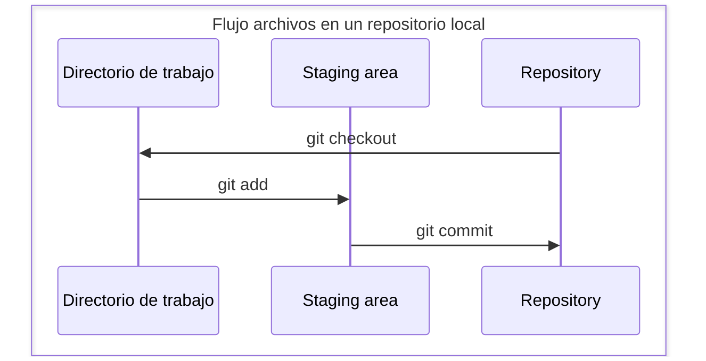

<div align="center">
<picture>
    <source srcset="https://imgur.com/5bYAzsb.png" media="(prefers-color-scheme: dark)">
    <source srcset="https://imgur.com/Os03JoE.png" media="(prefers-color-scheme: light)">
    
</picture>

<h3>Curso de Fundamentos de Robótica Móvil</h3>

<h1>Herramientas de Software</h1>

<h2>Uso de git y github</h2>

<h5>Pedro F. Cárdenas<br>
    Ricardo Ramírez<br>
    Juan S. Daleman</h5>

<h6>Universidad Nacional de Colombia<br>
    Facultad de Ingeniería<br>
    Departamento de Ingeniería Mecánica y Mecatrónica<br>
    Bogotá, Colombia<br>
    2025</h6>
</div>

<details>
    <summary>🗂️ Tabla de Contenido</summary>

<!-- TOC -->
- [1. 📖 Introducción](#1--introducción)
  - [1.1. 🤝🔄💻 ¿Qué es git?](#11--qué-es-git)
  - [1.2. 📦🌐👩‍💻 ¿Qué es github?](#12--qué-es-github)
- [2. 🧰 Herramientas Necesarias](#2--herramientas-necesarias)
  - [2.1. 🔭🛠️ Equipos](#21-️-equipos)
  - [2.2. 🖥️💾 Software](#22-️-software)
- [3. 🔧➡️🚀 Procedimiento](#3-️-procedimiento)
  - [4. 🪄📝 Inicializar un repositorio](#4--inicializar-un-repositorio)
  - [5. 🕵️‍♂️📝 Monitoreo de un archivo](#5-️️-monitoreo-de-un-archivo)
  - [🧐📄 Viendo los cambios de un archivo](#-viendo-los-cambios-de-un-archivo)
  - [🛠️🐙 Usando GitHub](#️-usando-github)
  - [Haciendo un merge](#haciendo-un-merge)
  - [Uso de ramas](#uso-de-ramas)
  - [Flujo de trabajo con git y github](#flujo-de-trabajo-con-git-y-github)
- [5. 🦾⚔️ Retos](#5-️-retos)
- [Comandos de git](#comandos-de-git)
- [Recomendaciones](#recomendaciones)
  - [Issues](#issues)
  - [Participación y comunidad](#participación-y-comunidad)
  - [Uso de SSH y llave de seguridad](#uso-de-ssh-y-llave-de-seguridad)
  - [5.0.1. 📌 Convenciones comunes para mensajes de commit en GitHub](#501--convenciones-comunes-para-mensajes-de-commit-en-github)
</details>

---

<h1> 📥🔄🐙💻 El uso de git y github </h1>

## 1. 📖 Introducción

### 1.1. 🤝🔄💻 ¿Qué es git?

Git es un sistema de control de versiones distribuido que permite registrar los cambios realizados en archivos a lo largo del tiempo, facilitando la colaboración entre múltiples desarrolladores. El término "git", en inglés informal británico, puede significar algo así como "tipo tonto" o "idiota", y fue elegido de forma humorística por su creador, Linus Torvalds. A pesar del nombre curioso, Git es una herramienta poderosa y ampliamente utilizada en el desarrollo de software para gestionar proyectos, revertir errores y trabajar en equipo de forma eficiente.

### 1.2. 📦🌐👩‍💻 ¿Qué es github?

GitHub es una plataforma en línea que permite alojar, gestionar y compartir proyectos de software utilizando el sistema de control de versiones Git. Funciona como una red social para desarrolladores, donde es posible colaborar en proyectos, revisar código, reportar errores y realizar mejoras mediante herramientas como pull requests y issues. GitHub facilita el trabajo en equipo, el control del historial de cambios y la publicación de código abierto o privado en repositorios accesibles desde cualquier lugar.

## 2. 🧰 Herramientas Necesarias

### 2.1. 🔭🛠️ Equipos

- Computador.

### 2.2. 🖥️💾 Software

- Ubuntu 20.04.

>[!IMPORTANT]
>Si usa windows es necesario instalar git, se recomienda usar Git Bash para seguir esta guia.

## 3. 🔧➡️🚀 Procedimiento

### 4. 🪄📝 Inicializar un repositorio

1. Para tener un repocitorio primero debemos tener un directorio para este. En este directorio se tendran todos los archivos que seran monitoreados.

```sh
mkdir mi_proyecto
cd mi_proyecto
```

2. Inicializar Git en el proyecto. Se nicializa un repositorio Git local en ese directorio. Crea la carpeta .git donde se guardará el historial.

```sh
git init
```

### 5. 🕵️‍♂️📝 Monitoreo de un archivo

Git está diseñado principalmente para trabajar con archivos de texto plano, como código fuente o documentación, ya que puede detectar y fusionar cambios línea por línea. Aunque también puede manejar archivos binarios, no ofrece las mismas ventajas y puede generar un historial más pesado y menos manejable.


1. Crea un archivo de texto plano de markdown.

```sh
touch README.md
```

>[!IMPORTANT]
>El archivo ``README.md`` es un documento de texto en formato Markdown que se usa comúnmente para describir un proyecto, explicar cómo instalarlo, usarlo y contribuir. Es el primer archivo que suelen ver los usuarios al visitar un repositorio, especialmente en plataformas como GitHub. 

2. Edita el archivo agregando algo de información para esto usa *Visual Studio Code*. Agrega algo como "Hola soy \<tu nombre>, estudio ingeneria ..." y guarda el documento.

```sh
code README.md
```

3. Para que git comience a monitoriar el archivo para esto se usa el comando `git add <nombre_archivo>` si tiene multiples archivos para agregar el repositorio puedes usar `git add .` el cual agrega todos los archivos que no se estan monitoriando en el directorio donde tenemos el repositorio.

```sh
git add README.md
```

4. Con lo anterior se mandan los archivos a un área en memoria conocida como `staging area`. Esta es un espacio de espera hasta guardar completamente en el repositorio. Pero antes de poder pasar los archivos al repositorio debe identificarse para que se sepa quien esta guardando los cambios para esto use los siguientes comandos.

```sh
git config --global user.name <Tu Nombre>
git config --global user.email <tuemail@dominio.com>
```

5. Una vez ya esta identificado en git se puede guardar los datos en el repositorio. Para eso se usa el comando `git commit`. Con la opción `-a` se pueden omitir el `git add` con los archivos que ya estan siendo monitoriando y con la opción `-m` se puede agregar un mensaje encerrado en comillas.

>[!CAUTION]
>Si no agregas un mensaje git abrira el editor de codigo por defecto que tenga y te hara escribir un mensaje para el commit.

>[!TIP]
>Por buena practica se suele poner una sigla en el mensaje para que se sepa de que tipo es el cambio esto lo puede ver en mayor detalle en la sección [5.0.1. 📌 Convenciones comunes para mensajes de commit en GitHub](#501--convenciones-comunes-para-mensajes-de-commit-en-github)

```sh
git commit -am "Feat: Se agrega archivo README.md"
```

Ya con todo esto se esta haciendo el monitoreo de los cambios en el archivo.




### 🧐📄 Viendo los cambios de un archivo

Con Git, una de las cosas más importantes es la posibilidad de ver los cambios entre archivos y documentos. Esto se logra gracias a los puntos de guardado llamados commits. Ahora, modifica el archivo README.md y haz un commit para poder aplicar los siguientes comandos.

1. Usa el comando `git status` con este comando se pude ver el estado de los archivos si hace falta agregarlos al *"staging area"* o si no se ha realizado el `commit` a estos.

2. Usa el comando `git log --graph --oneline --decorate` este te mostrara en la terminal entre parentecis las referencias que apuntan a un `commit` donde el *"Head"* es el punto donde va el repositorio, el mensaje del `commit` y un codigo hash el cual idenfica al `commit`

3. Usa el comando `git diff <hash_commit>` se puede ver las diferencias con el commit actual y el commit indicado. Modifica otra vez el archivo `README.md` has un nuevo `commit`. Ahora con `git diff <hash_commit_1> <hash_commit_2>` puedes ver las diferencias con un commit y otro.

4. Usa el comando `git blame README.md` con este veras en cada linea el ultimo commit en que se altero, quien lo hizo, fecha y hora de modificación.

### 🛠️🐙 Usando GitHub

Como se ha mostrado, Git y GitHub no son lo mismo. Git es una herramienta local para controlar versiones de código, mientras que GitHub es una plataforma en línea para alojar y colaborar en repositorios Git. A continuación, verás cómo conectar un repositorio Git con GitHub.

1. Ir a github y crear un repositorio en blanco.
2. Como nombre del repositorio pon tu nombre de usuario. Agrega una descripción como: *"Mi perfil de github"*. Dejalo en visibilidad publica y las demas opciones dejalas por defecto. Hablaremos más adelante de cada una.
3. Una vez creado el repositorio en blanco podemos ver las diferentes opciones de conectar el repositorio que es por una conexión https o ssh. Por temas de seguridad usaremos la ssh para esto es necesario la creación de una llave ssh.
4. Una vez creada la llave le diremos a github cual es la llave para la conexión.
5. Con la llave agregada conectaremos nuestro repositorio local con el repositorio de github con los siguientes comandos
6. Una vez conectado el repositorio con github podemos traer los cambios y publicarlos de la siguiente manera

### Haciendo un merge

### Uso de ramas

### Flujo de trabajo con git y github


## 5. 🦾⚔️ Retos

1. Usando git y github subiendo a github desde un git local un proyecto que hayas trabajado.
2. Has una lista de tareas simple y has el seguimiento de esta con git y github.


## Comandos de git

| Categoría                | Comando                          | Descripción                                         |
|--------------------------|----------------------------------|-----------------------------------------------------|
| Inicialización        | `git init`                        | Crea un repositorio Git local                       |
| Configuración         | `git config --global user.name`  | Establece el nombre de usuario                      |
|                          | `git config --global user.email` | Establece el correo del usuario                     |
| Seguimiento de archivos | `git status`                     | Muestra el estado actual del repositorio            |
|                          | `git add <nombre_archivo>`            | Agrega archivo al área de preparación               |
|                          | `git commit -m "mensaje"`        | Guarda cambios en el historial                      |
|                          | `git rm --cached <nombre_archivo>`    | Deja de hacer seguimiento a un archivo              |
| Historial             | `git log --graph --oneline --decorate`                         | Muestra el historial de commits                     |
|                          | `git diff`                        | Muestra diferencias entre versiones                 |
|                          | `git blame <nombre_archivo>`          | Muestra quién cambió cada línea de un archivo       |
|  Ramas                 | `git branch`                      | Lista las ramas disponibles                         |
|                          | `git checkout -b <nombre_nueva_rama>`     | Crea y cambia a una nueva rama                      |
|                          | `git merge <nombre_rama>`                 | Fusiona una rama con la actual                      |
| Repositorio remoto    | `git remote add origin <URL>`       | Conecta con un repositorio remoto                   |
|                          | `git push origin <nombre_rama_local>`        | Envía commits a la rama indicada en el remoto            |
|                          | `git pull origin <nombre_rama_remota>`                        | Descarga y fusiona cambios de una rama en el remoto               |

## Recomendaciones

### Issues

### Participación y comunidad

### Uso de SSH y llave de seguridad

### 5.0.1. 📌 Convenciones comunes para mensajes de commit en GitHub  

| **Sigla**   | **Significado**                                     | **Descripción** |
|------------|-------------------------------------------------|----------------|
| `feat`     | Feature (Nueva funcionalidad)                   | Se usa cuando se agrega una nueva función o característica al proyecto. |
| `fix`      | Fix (Corrección de errores)                     | Indica que se ha corregido un error en el código. |
| `docs`     | Documentation (Documentación)                   | Modificaciones en archivos de documentación (README, comentarios, etc.). |
| `style`    | Code Style (Estilo de código)                   | Cambios en formato, espacios o estilo sin afectar la funcionalidad. |
| `refactor` | Refactoring (Reestructuración)                  | Mejora en la estructura del código sin cambiar su comportamiento. |
| `perf`     | Performance (Optimización de rendimiento)       | Cambios que mejoran la velocidad o eficiencia del código. |
| `test`     | Testing (Pruebas)                               | Adición o modificación de pruebas automatizadas. |
| `chore`    | Chores (Tareas de mantenimiento)                | Actualizaciones menores, como cambios en dependencias o scripts. |
| `ci`       | Continuous Integration (Integración continua)   | Cambios en la configuración de CI/CD (GitHub Actions, Travis, etc.). |
| `build`    | Build (Compilación)                             | Cambios que afectan el proceso de construcción o dependencias. |
| `revert`   | Revert (Revertir cambios)                       | Deshacer un commit anterior. |


