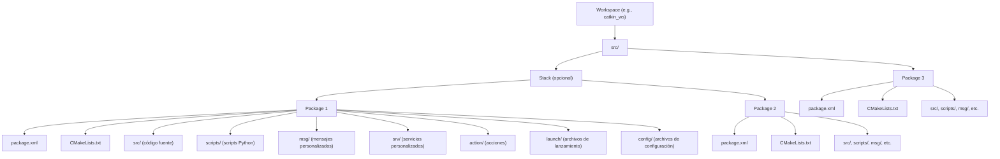
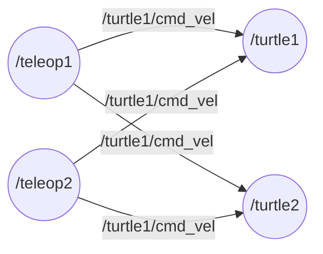
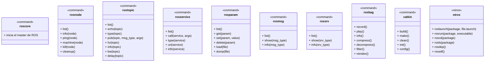

<div align="center">
<picture>
    <source srcset="https://imgur.com/5bYAzsb.png" media="(prefers-color-scheme: dark)">
    <source srcset="https://imgur.com/Os03JoE.png" media="(prefers-color-scheme: light)">
    
</picture>

<h3>Curso de Fundamentos de Robótica Móvil</h3>

<h1>Herramientas de Software</h1>

<h2>Introducción a ROS</h2>

<h4>Pedro F. Cárdenas<br>
    Ricardo Ramírez<br>
    Juan S. Daleman</h4>

<h6>Universidad Nacional de Colombia<br>
    Facultad de Ingeniería<br>
    Departamento de Ingeniería Mecánica y Mecatrónica<br>
    Bogotá, Colombia<br>
    2025</h6>
</div>

<details>
    <summary>🗂️ Tabla de Contenido</summary>

<!-- TOC -->
- [1. 📖 Introducción](#1--introducción)
- [2. 🎯 Objetivos](#2--objetivos)
- [3. 🧰 Herramientas Necesarias](#3--herramientas-necesarias)
  - [3.1. 🔭🛠️ Equipos](#31-️-equipos)
  - [3.2. 🖥️💾 Software](#32-️-software)
- [4. 🔧➡️🚀 Procedimiento](#4-️-procedimiento)
  - [4.1. 🏗🌐🤖Estructura de ROS](#41-estructura-de-ros)
  - [4.2. 🔌🔄🌐 Inicialización de nodos](#42--inicialización-de-nodos)
  - [4.3. 📤➡️📥 Publicación y suscripción entre nodos](#43-️-publicación-y-suscripción-entre-nodos)
  - [4.4. ⚙️🧮📝 Uso de parámetros](#44-️-uso-de-parámetros)
  - [4.5. 🛠️🔄⚙️ Uso de servicios](#45-️️-uso-de-servicios)
  - [4.6. 🏗️🧱🗂️ Crear un Workspace para ROS](#46-️️-crear-un-workspace-para-ros)
  - [4.7. 📝⚙️📦 Crear un paquete en ROS](#47-️-crear-un-paquete-en-ros)
  - [4.8. 🗣️💬🖥️ Lenguajes de programación con ROS](#48-️️-lenguajes-de-programación-con-ros)
    - [4.8.1. 📄🦾 Trabajando con archivos en C++](#481--trabajando-con-archivos-en-c)
      - [4.8.1.1. 🏗️📄 Estructura de archivos de código fuente](#4811-️-estructura-de-archivos-de-código-fuente)
      - [4.8.1.2. 🧩📄 Compilación de archivos fuente](#4812--compilación-de-archivos-fuente)
      - [4.8.1.3. 🚀🦾 Pruebas de archivos C++](#4813--pruebas-de-archivos-c)
    - [4.8.2. 📄🐍 Trabajando con archivos en python](#482--trabajando-con-archivos-en-python)
      - [4.8.2.1. ⚙️📄 Uso de archivos ejecutables](#4821-️-uso-de-archivos-ejecutables)
      - [4.8.2.2. 🏗️📄 Compilación de archivos fuente y uso de módulos](#4822-️-compilación-de-archivos-fuente-y-uso-de-módulos)
      - [4.8.2.3. 🚀🐍 Pruebas de archivos Python](#4823--pruebas-de-archivos-python)
  - [4.9. 🛠️🚀📄 Crear un archivo lanzador](#49-️-crear-un-archivo-lanzador)
- [5. ⌨️🌐🤖 Comandos de ros](#5-️-comandos-de-ros)
- [6. 🏷️🚀📄 Etiquetas para archivo Launch](#6-️-etiquetas-para-archivo-launch)
- [7. 📚🗄️ Referencias](#7-️-referencias)
</details>

---

<h1> 📚🌐🤖 Introducción a ROS </h1>

## 1. 📖 Introducción

En la actualidad, una de las herramientas más importantes para el estudio y trabajo con robots es la plataforma ROS. ROS, sigla de Robot Operating System (Sistema Operativo de Robots), no es técnicamente un sistema operativo independiente, ya que requiere de uno base para su funcionamiento; en cambio, se le considera un metasistema operativo.

El framework ROS proporciona bibliotecas, herramientas y un entorno de trabajo que simplifica la programación de tareas complejas. Además, cuenta con una amplia comunidad de desarrolladores, lo que facilita la resolución de problemas y fomenta el trabajo colaborativo en la creación de proyectos.

En esta guía se introducirá el framework ROS, presentando sus principales características y herramientas. Asimismo, se mostrará cómo programar en Python y cómo cargar estos programas (nodos) para que interactúen dentro del ecosistema que ROS ofrece.

## 2. 🎯 Objetivos

- Conocer el framework ROS.

- Familiarizarse con los elementos y comandos básicos de ROS.

- Aprender a crear un paquete y compilar programas en **C++** y **Python** dentro del entorno de ROS.

## 3. 🧰 Herramientas Necesarias

### 3.1. 🔭🛠️ Equipos

- Computador.

### 3.2. 🖥️💾 Software

- Ubuntu 20.04.
- ROS Noetic.

>[!IMPORTANT]
>Si aun no ha intalado ROS puede ver [🖥️📂 Guía 0 - Instalación de ROS Noetic](./../Instalacion.md) para el proceso de intalación.

## 4. 🔧➡️🚀 Procedimiento

### 4.1. 🏗🌐🤖Estructura de ROS

ROS (Robot Operating System) es un middleware para robótica que organiza la comunicación entre programas llamados nodos, los cuales realizan tareas específicas. Estos nodos se comunican enviando y recibiendo mensajes a través de tópicos en un esquema de publicador-suscriptor. Para interacciones más controladas, ROS ofrece servicios (solicitud-respuesta) y acciones (para tareas prolongadas que requieren feedback o cancelación). Un Master coordina a los nodos permitiendo que se encuentren entre sí (en ROS1), mientras que los datos pueden grabarse y reproducirse usando bags. Los proyectos se organizan en workspaces que contienen packages, y el arranque de múltiples nodos puede automatizarse con launch files. Esta estructura facilita el desarrollo de sistemas robóticos modulares, escalables y reutilizables.

<div align="center">
  
</div>

Un paquete es la unidad básica de organización del software: agrupa nodos, scripts, bibliotecas, mensajes, servicios, acciones y archivos de configuración relacionados. Cada paquete tiene una carpeta propia que contiene al menos un archivo `package.xml` (que describe el paquete y sus dependencias) y un `CMakeLists.txt` (que define cómo compilarlo). Dentro del paquete, el contenido se suele organizar en carpetas estándar como `src/` (código fuente), `scripts/` (scripts ejecutables en Python), `msg/` (definiciones de mensajes personalizados), `srv/` (definiciones de servicios), `action/` (definiciones de acciones), `launch/` (archivos de lanzamiento) y `config/` (archivos de configuración como parámetros). Los paquetes se agrupan dentro de un workspace (área de trabajo) que generalmente sigue la estructura `~/catkin_ws/src/` en ROS1, donde `catkin_ws` es el workspace y `src` contiene todos los paquetes. Esta organización modular permite desarrollar, compartir y mantener el software de forma ordenada y eficiente.



1. Abre una nueva terminal e inicia ros.

```sh
roscore
```

<div align="center">
  
</div>


### 4.2. 🔌🔄🌐 Inicialización de nodos

En ROS, los nodos son programas individuales que realizan tareas específicas y se comunican entre sí mediante tópicos, servicios o acciones; cada nodo debe registrarse con el rosmaster para poder intercambiar información.

`rosrun <nombre_paquete> <nombre_ejecutable>` permite ejecutar un nodo específico de un paquete sin necesidad de escribir su ruta completa.

1. Abra otra terminal y lance un nodo de `turtlesim` el cual es un simulado de una torutga en un plano. Con el nodo `turtlesim_node` genera la ventana donde aparece la tortuga y donde se puede simular su movimiento.

```sh
rosrun turtlesim turtlesim_node
```

<div align="center">
  
</div>

2. Abra una tercera terminal y lance un nodo `turtle_teleop_key` el cual permite teleoperar la tortuga mediante las teclas del teclado enviando comandos de velocidad lineal y angular al simulador para mover la tortuga.

```sh
rosrun turtlesim turtle_teleop_key
```

<div align="center">
  
</div>

3. Crear varias instancias del `turtlesim_node` y `turtle_teleop_key` es necesario cargarlas con otro nombre en diferentes terminales agregando el argumento `__name :=<nombre_nodo>`

```sh
rosrun turtlesim turtlesim_node __name:=turtle2
```

<div align="center">
  
</div>


```sh
rosrun turtlesim turtle_teleop_key __name:=teleop2
```

<div align="center">
  
</div>


4. Para ver toda la información de un nodo se usa `rosnode info <nombre_nodo>`. Con esta intrucción pueden ver todas las comunicaciones, conecciones y servicios asociados al nodo.

```sh
rosnode info /turtlesim
```

### 4.3. 📤➡️📥 Publicación y suscripción entre nodos

Los nodos se comunican a través de tópicos utilizando un modelo de publicación y suscripción: un nodo publicador envía mensajes a un tópico, mientras que uno o más nodos suscriptores los reciben si están conectados al mismo. Esta comunicación es asincrónica y está gestionada por el `rosmaster`, lo que permite que múltiples nodos intercambien datos sin necesidad de estar directamente conectados entre sí.

1. Use cada uno de los teleoperadores y vea el comportamiento de las tortugas. Si se utiliza cualquiera de los teleoperadores generados, puede observarse que, sin importar cuál envíe las instrucciones, ambas tortugas se moverán siguiendo las mismas trayectorias. Esto se debe a que ambos nodos `turtlesim_node` están suscritos al mismo tópico, `/turtle1/cmd_vel`, para recibir las instrucciones de movimiento, y ambos `teleoperadores` publican en ese mismo tópico. 

2. Para ver gráficamente la relación entre nodos se utiliza la herramienta `rqt_graph`. Con esta se podra ver los tópicos que relacionan los nodos, además de cual es publicador y cual es suscriptor.

```sh
rqt_graph
```



3. Los tipos de mensajes definen la estructura de los datos que se intercambian entre nodos a través de los tópicos. Estos mensajes pueden ser simples, como `std_msgs/String`, o complejos, como aquellos definidos por el usuario para representar estructuras personalizadas. Así, mediante el comando `rostopic type <nombre_tópico>`, es posible conocer el tipo de mensaje asociado a un tópico.

```sh
#Muestra que el topico /turtle1/cmd_vel utiliza la estructura geometry_msgs/Twist
rostopic type /turtle1/cmd_vel
```

<div align="center">
  
</div>

4. Una vez que conoces el tipo de mensaje de un tópico, el comando `rosmsg show <tipo_mensaje>` te permite ver la estructura del mensaje (es decir, cómo están organizados los campos dentro del mensaje). Este comando es útil para entender qué campos puedes utilizar y cómo están organizados los datos.

```sh
#Se puede ver que la estructura es de dos geometry_msgs/Vector3
#uno para velocidad angular y otro para velocidad lineal
rosmsg show geometry_msgs/Twist
```

<div align="center">
  
</div>

5. Para observar en tiempo real los mensajes publicados en un tópico, se puede utilizar un "sniffer" mediante el comando `rostopic echo <nombre_tópico>`. 

```sh
#Permite ver la posición y la oritenación de la turtle1
rostopic echo /turtle1/pose
```

<div align="center">
  
</div>

6. Para inyectar datos manualmente se usa el comando `rostopic pub -r <tasa_publicación_Hz> <nombre_tópico> <tipo_mensaje> <contenido_mensaje>`.

```sh
#Publica con una tasa de 1 Hz por defecto 
rostopic pub /turtle1/cmd_vel geometry_msgs/Twist "linear:
  x: 2.0
  y: 0.0
  z: 0.0
angular:
  x: 0.0
  y: 0.0
  z: 1.8"
```

<div align="center">
  
</div>

```sh
#Publica con una tasa de 2 Hz
rostopic pub -r 2 /turtle1/cmd_vel geometry_msgs/Twist "linear:
  x: 2.0
  y: 0.0
  z: 0.0
angular:
  x: 0.0
  y: 0.0
  z: 1.8"
```

<div align="center">
  
</div>

```sh
#Publica una unica vez el mensaje
rostopic pub -1 /turtle1/cmd_vel geometry_msgs/Twist "linear:
  x: 2.0
  y: 0.0
  z: 0.0
angular:
  x: 0.0
  y: 0.0
  z: 1.8"
```

<div align="center">
  
</div>

### 4.4. ⚙️🧮📝 Uso de parámetros

Los parámetros permiten almacenar y compartir configuraciones entre nodos a través del servidor de parámetros, facilitando ajustes como constantes, rutas o modos de operación sin modificar el código.

1. Para manejar los parametros en el servidor se usa el comando `rosparam`. Visualice cuales son los parametros que estan actualmente estan almacenados en el servido.

```sh
rosparam list
```

<div align="center">
  
</div>

2. Para la obtener el valor de un parametro se usa el comando `rosparam get <nombre_parametro>`.

```sh
#Entrega el nombre de la distribución de ros que se esta usando
rosparam get /rosdistro
```

<div align="center">
  
</div>

```sh
#Entrega el valor en bits del componente azul
#para el color de fondo de la tortuga
rosparam get /turtlesim/background_b
```

<div align="center">
  
</div>

3. Para inyectar datos a un parametro se usa `rosparam set <nombre_parametro> <valor_parametro>`.

```sh
#Cambia el valor en bits del color de fondo
#la tortuga ahora al abrirse una nueva tortuga
#el fondo sera rojo
rosparam set /turtlesim/background_r 255
rosparam set /turtlesim/background_g 0
rosparam set /turtlesim/background_b 0
```

<div align="center">
  
</div>

### 4.5. 🛠️🔄⚙️ Uso de servicios

Los servicios en permiten la comunicación síncrona entre nodos, donde un nodo solicita un servicio y espera una respuesta. Estos son útiles para tareas que requieren una interacción directa y un retorno de datos, como la ejecución de cálculos o la obtención de información específica.

1. Para manejar los servicios se usa el comando `rosservice`. Visualice cuáles son los servicios que actualmente están disponibles en el sistema.

```sh
rosservice list
```

<div align="center">
  
</div>

2. Para usar un servicio se usa lo que es un llamado para esto se usa `rosservice call <nombre_servicio>`.

```sh
#Hace el llamado al servicio que limpia el recorrido de la tortuga
rosservice call /clear
```

<div align="center">
  
</div>

3. Para conocer toda la información de un servicio se usa el comando ` rosservice info <nombre_servicio>`.

```sh
#Muestra que nodo provee el servicio, conexión, tipo de servicio y argumentos del servicio
rosservice info /spawn
```

<div align="center">
  
</div>

4. Para ver que tipo de datos son los argumentos de un servicio se usa la convinancion de de comandos `rosservice type <nombre_servicio> | rossrv show`.

```sh
#Muestra los tipos de datos que espera el servicio /spwan
#Despues del `---` muestra los argumentos opcionales
rosservice type /spawn | rossrv show
```

<div align="center">
  
</div>

### 4.6. 🏗️🧱🗂️ Crear un Workspace para ROS

Un workspace es una carpeta de trabajo donde el usuario puede desarrollar, compilar y gestionar sus propios paquetes. La estructura típica incluye un directorio src/ que contiene los paquetes, y se construye con la herramienta catkin, mediante comandos como catkin_make. Este entorno permite compilar múltiples paquetes a la vez y facilita la integración y prueba de nodos personalizados dentro del ecosistema de ROS.

1. Cree un directorio el cual contendra el workspace. Un nombre muy común es `catkin_ws` y el subdirectorio `src`. 

```sh
mkdir -p ~/catkin_ws/src
```

<div align="center">
  
</div>


2. Ingresa en el directorio y con `catkin_make` se compila todo el Workspace.

```sh
cd ~/catkin_ws
catkin_make
```

<div align="center">
  
</div>

Con esto se tendran tres carpetas en el directorio las cuales son:

 - **src/**: Esta es la carpeta donde se colocan todos los paquetes de ROS. Contiene el código fuente de los paquetes que el usuario desarrolla, incluyendo nodos, librerías y otros recursos necesarios para el proyecto. Es el lugar donde se crean o clonan los paquetes.

 - **devel/**: Esta carpeta se genera cuando se compila el workspace. Contiene archivos de desarrollo, como bibliotecas compiladas, archivos de configuración y otros artefactos necesarios para ejecutar y probar los nodos en el entorno de desarrollo. No es necesario modificar esta carpeta directamente.

- **build/**: Aquí es donde se almacenan los archivos temporales generados durante el proceso de compilación. ROS utiliza esta carpeta para almacenar los resultados intermedios de la construcción de los paquetes, como los archivos objeto generados y los productos de compilación de cada paquete. Al igual que `devel/`, no es necesario modificar esta carpeta manualmente.

### 4.7. 📝⚙️📦 Crear un paquete en ROS

Un paquete en ROS es la unidad básica de organización del software, y contiene todo lo necesario para realizar una tarea específica, como nodos, bibliotecas, scripts, archivos de configuración, mensajes personalizados y archivos de lanzamiento (launch). Cada paquete debe tener al menos dos archivos obligatorios: package.xml (que define las dependencias y metadatos del paquete) y CMakeLists.txt (que especifica cómo se debe compilar e instalar el paquete con catkin).

1. Ubíquese en la carpeta `src` del workspace.

```sh
cd ~/catkin_ws/src
```

2. Crea el paquete con `catkin_create_pkg <nombre_paquete> [dependencias]`.

```sh
catkin_create_pkg hello_word
```

<div align="center">
  
</div>

3. Dentro del directorio principal del paquete cree un directorio `scripts` e ingrese al directorio.

```sh
cd ~/catkin_ws/src/hello_word
mkdir scripts && cd scripts
```

4. Copie el archivo [Hello.py](./scripts/Hello.py) en el directorio.
5. Cambie los permisos de `Hello.py` a ejecutable.

```sh
chmod +x Hello.py
```

<div align="center">
  
</div>

6. Cambie al directorio principal del workspace y cargue la configuración del entorno de su workspace para que ROS pueda encontrar los paquetes, nodos y configuraciones que has creado.

```sh
cd ~/catkin_ws
source devel/setup.bash
```

>[!IMPORTANT]
>Cada vez que se modifiquen archivos dentro de un paquete o se modifique el workspace es necesario compilar y cargar la configuración. Excepto con ejecutables de python es solo necesario cargar la configuración.
>```sh
>#Compila todo el workspace
>catkin_make
>source devel/setup.bash
>```
>```sh
>#Compila solo un paquete del workspace
>#`catkin build` pude compilar todo el workspace pero se recomienda en proyectos grandes
>catkin build <nombre_paquete>
>source devel/setup.bash
>``


>[!TIP]
> Para que el entorno de ROS se configure automáticamente cada vez que abres una terminal. Esto significa que no tendrás que escribir `source devel/setup.bash` manualmente en cada nueva sesión en el worspace. Puedes agregarlo a la conmfiguración del bash.
>```sh
>echo "source ~/catkin_ws/devel/setup.bash" >> ~/.bashrc
>```

7. Corra el nodo `talker` creado con el archivo `Hello.py`.

```sh
rosrun hello_word Hello.py
``` 

<div align="center">
  
</div>

### 4.8. 🗣️💬🖥️ Lenguajes de programación con ROS

Los lenguajes de programación principales son C++ y Python, siendo C++ ideal para aplicaciones de alto rendimiento y Python preferido por su simplicidad y rapidez en el desarrollo. ROS proporciona soporte a través de las bibliotecas roscpp para C++ y rospy para Python. También existe soporte parcial para otros lenguajes como Java (con rosjava) y JavaScript (a través de roslibjs para interfaces web), aunque su uso es menos común.

Dado que C++ y Python son los lenguajes principales en ROS, se explicará cómo utilizarlos dentro de los paquetes.

1. En el workspace creado clone el paquete `laboratorio_2` del respositorio del [laboratorio 2](https://github.com/labsir-un/FRM_Lab_2_Sensores_y_ROS) en la carpeta `/src`.

```sh
cd ~/catkin_ws/src
mkdir laboratorio_2 && cd laboratorio_2
git init
git remote add origin https://github.com/labsir-un/FRM_Lab_2_Sensores_y_ROS.git
git config core.sparsecheckout true
git sparse-checkout set Recursos/ROS/laboratorio_2
git pull origin main
mv Recursos/ROS/laboratorio_2/* ./
rm -r Recursos/
```

2. Compile el workspace.

```sh
cd ~/catkin_ws
catkin_make
source devel/setup.bash
```

El paquete tiene los siguientes directorios y archivos:

- **/launch:** Contiene un archivo de lanzamiento.
- **/scripts:** Contiene los scripts ejecutables.
- **/src:** Contiene los archivos cone los códigos fuente.
- **CMakeLists.txt:** Contiene la configuración que utiliza CMake para definir cómo se debe compilar y construir el paquete.
- **package.xml:**  Contiene la definición de la configuración y los metadatos del paquete.
- **setup.py:** Contine la gestion de la instalación, dependencias y scripts ejecutables de un paquete Python en ROS.

#### 4.8.1. 📄🦾 Trabajando con archivos en C++

##### 4.8.1.1. 🏗️📄 Estructura de archivos de código fuente

1. En el paquete `laboratorio_2` ubíquese en el directorio `/src` y vea los archivos que estan en este. En este se encuentran tres archivos de C++ (`hello.cpp`, `pubvel.cpp` y ` subpose.cpp`) y un directorio (`laboratorio_2`).

```sh
cd ~/catkin_ws/src/laboratorio_2/src
ls -l
```

2. Abra con un editor de código (Visual Studio code o Nano) el archivo `hello.cpp`.

```sh
#Abrir el archivo con visual estudio code
code hello.cpp
```

```sh
#Abrir el archivo con nano
nano hello.cpp
```

3. En la primera sección del archivo vera que se incluye el archivo de encabezado `ros./ros.h` el cual es la librería que contiene las declaraciones de clases, funciones y macros necesarias para que un programa en C++ pueda interactuar con el sistema ROS, como inicializar nodos, manejar publicaciones y suscripciones, trabajar con servicios y parámetros, entre otras funcionalidades.

```cpp
#include <ros/ros.h>
```

4. Dentro de la función `main` se encuentra la intrucción `ros : init` inicializa el sistema ROS en el nodo de C++. Dentro de los argumentos de la funcion se tienen: `argc, argv` los cuales ase pasan desde `main` y permiten a ROS procesar argumentos de línea de comandos y `"hello"` el cual es el nombre de la instancia del nodo.

```cpp
// Initialize the ROS system.
ros::init(argc, argv, "hello");
```

5. Luego en la función encontrara `ros :: NodeHandle nh` establece el programa como un nodo.


```cpp
// Establish this program as a ROS node.
ros::NodeHandle nh;
```

6. Por ultimo `ROS_INFO_STREAM` envía mensajes de registro (log) al sistema ROS. Funciona como std::cout, pero está integrado al sistema de logging de ROS, lo cual permite filtrar y redirigir los mensajes según su nivel (en este caso, nivel INFO).

```cpp
// Send some output as a log message.
ROS_INFO_STREAM( "Hello ROS" );
```

7. Corra el nodo en ROS.

```sh
rosrun laboratorio_2 hello
```

8. Abra con un editor de código (Visual Studio code o Nano) el archivo `pubvel.cpp`.

```sh
code pubvel.cpp
```

9. En la primera sección del archivo se incluye el encabezado `geometry_msgs/Twist.h`, que contiene las declaraciones correspondientes al tipo de mensaje `Twist`. Cada tipo de mensaje está asociado a un archivo de cabecera en C++, y estos se importan utilizando la estructura `#include <nombre_paquete/nombre_tipo_mensaje.h>`.

```cpp
#include <geometry_msgs/Twist.h> // For geometry_msgs::Twist
```

10. Dentro de la función `main` se crea el publicador el cual tiene la estructura.

```cpp
ros::Publisher pub = node_handle.advertise<tipo_mensaje>(nombre_topico, tamaño_cola);
```

En esta declaración, `ros::Publisher` indica que la variable será un publicador; `pub` es la variable que almacena el publicador; `node_handle` representa el handle del nodo; `advertise` es el método del objeto tipo NodeHandle; `tipo_mensaje` corresponde al tipo de mensaje que se publicará en el tópico; `nombre_topico` es el nombre que tendrá dicho tópico; y `tamaño_cola` define el tamaño de la cola de mensajes. Esta cola se utiliza para almacenar los mensajes en caso de que los suscriptores no puedan procesarlos a tiempo, hasta alcanzar el límite especificado.

```cpp
// Create a publisher object.
ros::Publisher pub = nh.advertise<geometry_msgs::Twist>(
"turtle1/cmd_vel", 1000);
```

Nótese que, para declarar el tipo de mensaje, se utiliza la estructura `package_name::type_name`. En este caso, se publica en el tópico `"turtle1/cmd_vel"` y el tamaño de la cola es de 1000, lo que significa que se podrán almacenar hasta 1000 mensajes si no pueden ser procesados a tiempo.

11. Abra con un editor de código (Visual Studio code o Nano) el archivo `subpose.cpp`.

```sh
code subpose.cpp
```

12. En la primera sección del archivo se incluye el encabezado `turtlesim/Pose.h`, que contiene las declaraciones correspondientes al tipo de mensaje `turtlesim/Pose`.

```cpp
#include <turtlesim/Pose.h>
```

13. Dentro de la función `main` se crea el publicador el cual tiene la estructura.

```cpp
ros::Subscriber sub = node_handle.subscribe(topic_name,   
queue_size, pointer_to_callback_function);
```

En esta declaración, `ros::Subscriber` indica que la variable será un suscriptor; `sub` es la variable que almacena el suscriptor; `node_handle` representa el handle del nodo; `asubscribe` es el método del objeto tipo NodeHandle; `nombre_topico` es el nombre que tendrá dicho tópico; `tamaño_cola` define el tamaño de la cola de mensajes; y `pointer_to_callback_function` es la función de callback que se ejecutará cada vez que se reciba un nuevo mensaje en el tópico.

```cpp
// Create a subscriber object.
ros::Subscriber sub = nh.subscribe("turtle1/pose", 1000, &poseMessageReceived);
```

En este caso, se suscribe al tópico `"turtle1/pose"`, el tamaño de la cola es de 1000 y se llama a la función `poseMessageReceived`. El `&` indica que estamos pasando la dirección de la función.

14.  Nótese que en la función `callback` el parametro `const turtlesim::Pose& msg` es una referencia constante al mensaje recibido. Donde el `&` indica que se trabaja directamente con el mensaje recibido.

```cpp
// A callback function. Executed each time a new pose message arrives.
void poseMessageReceived(const turtlesim::Pose& msg) 
{
    ROS_INFO_STREAM(std::setprecision(2) << std::fixed << "position=("
    << msg.x << "," << msg.y << ")" << " direction=" << msg.theta);
}
```

##### 4.8.1.2. 🧩📄 Compilación de archivos fuente

Para compilar correctamente se debe configurar correctamente la información de los archivos `CMakeList.txt` y `package.xml` para indicarle a `CMake` como se debe compilar el paquete y definir la configuración y metadatos del paquete.

1. Ubíquese en el directorio raiz del paquete y abra con un editor de codigo el archivo `CMakeList.txt`.

```sh
cd ~/catkin_ws/src/laboratorio_2/
code CMakeList.txt
```

2. En el archivo se encuentra la sección `find_package` la cual le dice a CMake que debe encontrar e incluir el entorno de desarrollo de ROS (catkin) y los paquetes que se listan como dependencias. Con `REQUIRED` se indica que estos componentes son obligatorios y `COMPONENTS` da a lista de paquetes ROS que este proyecto necesita. En este caso se agrega `rospy` para compilar Python, `turtlesim` para indicar que es un paquete obligatorio, `roscpp` para compilar C++ y `geometry_msgs` para indicar que se usa dicha libreria de mensajes.

```cmake
find_package(catkin REQUIRED COMPONENTS
    rospy
    turtlesim
    roscpp
    geometry_msgs
)
```

3. En la siguiente sección se encontrara la instrucción `catkin_package()` su propósito es declarar que este directorio es un paquete de catkin y exportar información a otros paquetes que dependan de él.

4. En la siguiente sección se encontrara la instrucción `include_directories( ${catkin_INCLUDE_DIRS})` la cual sirve para indicar al compilador dónde buscar archivos de cabecera (.h) necesarios para compilar tu código.

5. En la siguiente sección se encontrara las instrucciones `add_executable` la cual le dicen a CMake que debe compilar archivos fuente específicos como ejecutables. su estructura es `add_executable(<nombre_ejecutable> <ruta_archivo_fuente>)`

```cmake
add_executable(hello src/hello.cpp)
add_executable(pubvel src/pubvel.cpp)
add_executable(subpose src/subpose.cpp)
```

6. En la siguiente sección se encontrara las instrucciones `target_link_libraries` indican al compilador que debe vincular cada ejecutable con las bibliotecas de ROS necesarias para que funcionen correctamente. su estructura es `target_link_libraries(<nombre_ejecutable> ${catkin_LIBRARIES})`

```cmake
target_link_libraries(hello ${catkin_LIBRARIES})
target_link_libraries(pubvel ${catkin_LIBRARIES})
target_link_libraries(subpose ${catkin_LIBRARIES})
```

7. Abra con un editor de codigo el archivo `package.xml`.

```sh
code package.xml
```

8. En la sección `<buildtool_depend>catkin</buildtool_depend>` se veran las diferentes etiquetas para dependencias del paquete. La etiqueta `<buildtool_depend` indica que el paquete necesita catkin como herramienta de construcción (build system).

9. Luego se indican las dependencias las cuales son necesarias para compilar el código con la etiqueta `build_depend`.

```xml
<!-- Indica la dependencia de C++-->
<build_depend>roscpp</build_depend>
<!-- Indica la dependencia del uso de la libreria geometry_msgs-->
<build_depend>geometry_msgs</build_depend>
```

10. Por ultimo se encuentran las dependencias son necesarias para ejecutar el código ya compilado indicadas con la etiqueta `exec_depend`.

```xml
<!-- roscpp debe estar disponible al correr un nodo en C++, aunque ya esté compilado. -->
<exec_depend>roscpp</exec_depend>
```

##### 4.8.1.3. 🚀🦾 Pruebas de archivos C++

>[!CAUTION]
>Para las pruebas deben estar corriendo el Master y en este caso el turtlesim.

1. Ejecute el ejecutable `hello`.

```sh
rosrun laboratorio_2 hello
```

<div align="center">
  
</div>

2. Ejecute el ejecutable `subpose`.

```sh
rosrun laboratorio_2 subpose
```

<div align="center">
  
</div>

3. Abra una nueva terminal y ejecute el ejecutable `pubvel`

```sh
rosrun laboratorio_2 pubvel
```

<div align="center">
  
</div>

#### 4.8.2. 📄🐍 Trabajando con archivos en python

##### 4.8.2.1. ⚙️📄 Uso de archivos ejecutables

Los scripts ejecutables de Python se colocan comúnmente en la carpeta scripts/ y se ejecutan directamente porque Python es un lenguaje interpretado, lo que significa que no necesita ser compilado como C++. Por eso, estos archivos deben tener un encabezado especial conocido como shebang (`#!/usr/bin/env python`) para que el sistema sepa usar el intérprete de Python, y además requieren permiso de ejecución (`chmod +x`). A diferencia de los nodos en C++, los scripts de Python no se declaran en `CMakeLists.txt` con `add_executable`, ya que no generan binarios, sino que se ejecutan tal como están con `rosrun` o desde un archivo `.launch`.

1. De permisos de ejecución a los scripts de python.

```sh
#Da permisos de ejecución a todos los archivos .py 
chmod +x ~/catkin_ws/src/laboratorio_2/scripts/*.py
```

2. Cargue la configuración del entorno de su workspace. Como no es necesario compilar los archivos no es necesario indicar los archivos en el `CMakeList.txt` ni tener las dependencias declaradas en `package.xml`.

```sh
cd ~/catkin_ws
source devel/setup.bash
```

>[!NOTE]
>Vea que en la sección [4.7. 📝⚙️📦 Crear un paquete en ROS](#47-️-crear-un-paquete-en-ros) se hizo lo mismo para crear el paquete y este no tenia dependencias declaradas en su creación.

##### 4.8.2.2. 🏗️📄 Compilación de archivos fuente y uso de módulos

En caso que se desee trabajar con módulos personalizados es necesario instalarlos para que los scripts que los usen puedan hacer la importación de ellos adecuadamente.

1. En el paquete `laboratorio_2` ubíquese en el directorio raiz y vea los archivos que estan en este. Dentro de estos esta un archivo que es el `setup.py` el cual configura que se utiliza para empaquetar e instalar el código Python.

```sh
cd ~/catkin_ws/src/laboratorio_2/src
ls -l
```

2. Abra con un editor de código el archivo `setup.py`.

```sh
code setup.py
```

3. Los módulos importados en este archivo cumplen con funciones específicas: `from distutils.core import setup` importa la función setup de `distutils`, que es la encargada de ejecutar el proceso de instalación; `from catkin_pkg.python_setup import generate_distutils_setup` importa la función `generate_distutils_setup`, que genera los parámetros adecuados para `setup()` basados en la configuración de ROS. Este método es específico de ROS y facilita la integración de paquetes ROS con el sistema de instalación de Python.

```py
from distutils.core import setup
from catkin_pkg.python_setup import generate_distutils_setup
```

4. La variable `package_name` es la que guarda el nombre del paquete.

5. Dentro de la función `generate_distutils_setup` se dan como parametros `packages` que es una lista de los paquetes necesarios para el módulo y `package_dir` que especifica la ruta dentro del paquete del código fuente.

```py
setup_args = generate_distutils_setup(
    packages=[package_name],
    package_dir={'': 'src'},  # Indica que el código fuente está en 'src/'
)
```

6. Por ultimo `setup(**setup_args)` ejecuta el proceso de instalación utilizando los parámetros generados previamente por `generate_distutils_setup`.

7. Ubíquese en el directorio `src/laboratorio_2` y vea los archivos que estan en este. Nótese que se tiene un archivo `_init_.py` que le indica a python quye es un modulo y 2 archivos (`background_changer.py` y `turtle_manager.py`) que son los archivos fuente.

>[!IMPORTANT]
>Nótese que el modulo principal tiene el mismo nombre que el paquete esto es necesario para que ROS pueda identificar los modulos facilmente, aunque no estrictamente necesaria se recomienda hacerlo.

```sh
cd ~/catkin_ws/src/laboratorio_2/src/laboratorio_2
ls -l
```

8. Ubíquese en el directorio de scripts del paquete.

```sh
cd ~/pruebas_ws/src/laboratorio_2/scripts
```

9. Abra en un editor de codigo el archivo `pycontroller.py`.

```sh
code pycontroller.py
```

10. Vea que en la importación de módulos se tiene los dos archivos anteriormente vistos.

```py
# Importar los módulos de la misma estructura de paquete
from laboratorio_2.background_changer import BackgroundChanger
from laboratorio_2.turtle_manager import TurtleManager
```

11. Ubíquese en el directorio raiz del paquete y abra con un editor de codigo el archivo `CMakeList.txt`.

```sh
cd ~/catkin_ws/src/laboratorio_2/
code CMakeList.txt
```

12.  En el archivo se encuentra la sección `find_package` se tiene a `rospy` para compilar Python para el módulo.

```cmake
find_package(catkin REQUIRED COMPONENTS
    rospy
    turtlesim
    roscpp
    geometry_msgs
)
```

13. En la siguiente sección se encontrara la instrucción `catkin_python_setup()` su propósito es habilitar la instalación de scripts y módulos Python mediante el archivo `setup.py`.

14. En la ultima parte del archivo se encuentra la instrucción `catkin_install_python`. Donde `PROGRAMS` lista los archivos Python que deseas instalar como ejecutables, `scripts/pycontroller.py` es el script que se desea hacer ejecutable y `DESTINATION ${CATKIN_PACKAGE_BIN_DESTINATION}` especifica el directorio de instalación (por convención, es algo como `lib/<paquete>` y ROS ya sabe buscar ahí).

```cmake
catkin_install_python(PROGRAMS
   scripts/pycontroller.py
   DESTINATION ${CATKIN_PACKAGE_BIN_DESTINATION}
)
```

15. Abra con un editor de codigo el archivo `package.xml`.

```sh
code package.xml
```

16. Luego se indican las dependencias las cuales son necesarias para compilar el código con la etiqueta `build_depend`.

```xml
<!-- Indica la dependencia de python-->
<build_depend>rospy</build_depend>
<!-- Indica la dependencia del uso de la libreria geometry_msgs-->
<build_depend>geometry_msgs</build_depend>
```

10. Por ultimo se encuentran las dependencias son necesarias para ejecutar el código ya compilado indicadas con la etiqueta `exec_depend`.

```xml
<!-- roscpp debe estar disponible al correr un nodo en python, aunque ya esté compilado. -->
<exec_depend>rospy</exec_depend>
```

##### 4.8.2.3. 🚀🐍 Pruebas de archivos Python

>[!CAUTION]
>Para las pruebas deben estar corriendo el Master y en este caso el turtlesim.


1. Ejecute el ejecutable `pysubpose.py`.

```sh
rosrun laboratorio_2 pysubpose.py
```

<div align="center">
  
</div>

2. Abra una nueva terminal y ejecute el ejecutable `pubvel`

```sh
rosrun laboratorio_2 pubvel
```

<div align="center">
  
</div>

>[!NOTE]
>Note que el nodo pubvel esta en C++ y pysubpose.py esta en python e interactuan sin problema

3. Dentenga el ejecutable `pubvel` y ejecute el ejecutable `pypubvel.py`

```sh
rosrun laboratorio_2 pypubvel.py
```

<div align="center">
  
</div>

4. Detenga los ejecutables y ejecute el ejecutable `pycontroller.py`.

```sh
rosrun laboratorio_2 pycontroller.py
```

<div align="center">
  
</div>

<div align="center">
  
</div>


### 4.9. 🛠️🚀📄 Crear un archivo lanzador

Un archivo launch se utiliza para ejecutar varios nodos simultáneamente y, a su vez, cargar automáticamente los parámetros necesarios si estos lo requieren. Esto facilita el desarrollo de aplicaciones en ROS que necesiten una preparación previa compuesta por múltiples pasos.

Un archivo launch es un archivo XML que describe cómo iniciar uno o más nodos, establecer parámetros, incluir otros archivos de lanzamiento y definir configuraciones de ejecución, facilitando el manejo coordinado de múltiples procesos dentro de un sistema robótico.

1. Ubíquese en el directorio `/launch` del paquete y abra con un editor de codigo el archivo `p.launch`.

```sh
cd ~/pruebas_ws/src/laboratorio_2/launch
code p.launch
```

2. Vea que se tienen las etiquetas `node` donde tiene los atributos
`pkg` el cual indica a que paquete pertenece el nodo, `type` es el tipo de nodo o nombre del ejecutable y `name` es el nombre que se le dará al nodo. Además, es opcional poner mas atributos como los argumentos,output, etc.

3. Ejecute el archivo p.launch. Para esto se usa el comando `roslaunch <nombre_paquete> <nombre_archivo_launch>`.

```sh
roslaunch laboratorio_2 p.launch
```

>[!TIP]
>Con el `.launch` no es necesario tener el `roscore` corriendo.

<div align="center">
  
</div>

## 5. ⌨️🌐🤖 Comandos de ros



## 6. 🏷️🚀📄 Etiquetas para archivo Launch

| **Etiqueta**     | **Función**                                               | **Ejemplo**                                                                 |
|------------------|------------------------------------------------------------|------------------------------------------------------------------------------|
| `<node>`         | Lanza un nodo de un paquete                                | `<node pkg="turtlesim" type="turtlesim_node" name="turtle"/>`              |
| `<param>`        | Define un parámetro individual                             | `<param name="vel" value="1.0"/>`                                           |
| `<rosparam>`     | Carga parámetros desde archivo YAML o bloque inline        | `<rosparam file="$(find mi_paquete)/config.yaml" command="load"/>`         |
| `<include>`      | Incluye otro archivo `.launch`                             | `<include file="$(find otro_pkg)/launch/otro.launch"/>`                    |
| `<group>`        | Agrupa nodos con un namespace o remapeos comunes           | `<group ns="robot1"> ... </group>`                                          |
| `<remap>`        | Cambia nombres de tópicos, servicios o parámetros          | `<remap from="/cmd_vel" to="/robot1/cmd_vel"/>`                             |
| `<arg>`          | Declara argumentos personalizables                         | `<arg name="vel" default="1.0"/>`                                           |
| `<env>`          | Establece variables de entorno                             | `<env name="ROS_LOG_DIR" value="/tmp/roslogs"/>`                            |


## 7. 📚🗄️ Referencias

**[1]** A. Martinez and E. Fernández, *Learning ROS for Robotics Programming*, Birmingham B3 2PB, UK: Packt Publishing Ltd, 2013.

**[2]** J. M. O'Kane, *A Gentle Introduction to ROS*, University of South Carolina: Packt Publishing Ltd, 2014.

**[3]** N. Sprague, "Turtlesim," [Online]. Available: [http://wiki.ros.org/turtlesim](http://wiki.ros.org/turtlesim).

**[4]** J. Faust, "Roscheatsheet," [Online]. Available: [https://w3.cs.jmu.edu/spragunr/CS354_F17/handouts/ROSCheatsheet.pdf](https://w3.cs.jmu.edu/spragunr/CS354_F17/handouts/ROSCheatsheet.pdf).

**[5]** ROS, "Roslaunch XML," [Online]. Available: [http://wiki.ros.org/roslaunch/XML](http://wiki.ros.org/roslaunch/XML).

**[6]** ——, "rospy services," [Online]. Available: [http://wiki.ros.org/rospy/Overview/Services](http://wiki.ros.org/rospy/Overview/Services).

**[7]** L. Cruz, "ROS (Robot Operating System) — Fundamentos", 2019. [Online]. Available: [https://medium.com/@robtech.impaciente/ros-robot-operating-system-fundamentos-e92478c26e02](https://medium.com/@robtech.impaciente/ros-robot-operating-system-fundamentos-e92478c26e02).
