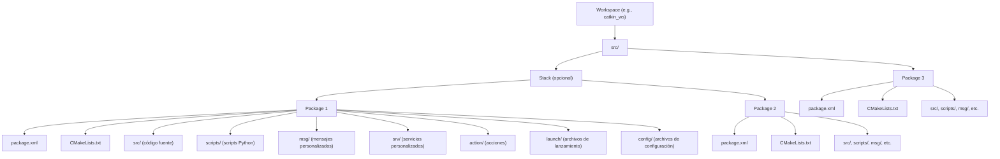

<div align="center">
<picture>
    <source srcset="https://imgur.com/5bYAzsb.png" media="(prefers-color-scheme: dark)">
    <source srcset="https://imgur.com/Os03JoE.png" media="(prefers-color-scheme: light)">
    
</picture>

<h3>Curso de Fundamentos de Robótica Móvil</h3>

<h1>Herramientas de Software</h1>

<h2>Introducción a ROS</h2>

<h4>Pedro F. Cárdenas<br>
    Ricardo Ramírez<br>
    Juan S. Daleman</h4>

<h6>Universidad Nacional de Colombia<br>
    Facultad de Ingeniería<br>
    Departamento de Ingeniería Mecánica y Mecatrónica<br>
    Bogotá, Colombia<br>
    2025</h6>
</div>

<details>
    <summary>🗂️ Tabla de Contenido</summary>

<!-- TOC -->
- [1. 📖 Introducción](#1--introducción)
- [2. 🎯 Objetivos](#2--objetivos)
- [2. 🧰 Herramientas Necesarias](#2--herramientas-necesarias)
  - [2.1. 🔭🛠️ Equipos](#21-️-equipos)
  - [2.2. 🖥️💾 Software](#22-️-software)
- [3. 🔧➡️🚀 Procedimiento](#3-️-procedimiento)
  - [🏗🌐🤖Estructura de ROS](#estructura-de-ros)
  - [Uso de nodos](#uso-de-nodos)
  - [Uso de parametros](#uso-de-parametros)
  - [Comunicación entre nodos](#comunicación-entre-nodos)
  - [Crear un Workspace y un paquete en ROS](#crear-un-workspace-y-un-paquete-en-ros)
  - [Compilación de archivos en C++](#compilación-de-archivos-en-c)
  - [Compilación de archivos en python](#compilación-de-archivos-en-python)
  - [Crear un archivo lanzador](#crear-un-archivo-lanzador)
- [4. 📚🗄️ Referencias](#4-️-referencias)
</details>

---

<h1> 📚🌐🤖 Introducción a ROS </h1>

## 1. 📖 Introducción

En la actualidad, una de las herramientas más importantes para el estudio y trabajo con robots es la plataforma ROS. ROS, sigla de Robot Operating System (Sistema Operativo de Robots), no es técnicamente un sistema operativo independiente, ya que requiere de uno base para su funcionamiento; en cambio, se le considera un metasistema operativo.

El framework ROS proporciona bibliotecas, herramientas y un entorno de trabajo que simplifica la programación de tareas complejas. Además, cuenta con una amplia comunidad de desarrolladores, lo que facilita la resolución de problemas y fomenta el trabajo colaborativo en la creación de proyectos.

En esta guía se introducirá el framework ROS, presentando sus principales características y herramientas. Asimismo, se mostrará cómo programar en Python y cómo cargar estos programas (nodos) para que interactúen dentro del ecosistema que ROS ofrece.

## 2. 🎯 Objetivos

- Conocer el framework ROS.

- Familiarizarse con los elementos y comandos básicos de ROS.

- Aprender a crear un paquete y compilar programas en **C++** y **Python** dentro del entorno de ROS.

## 2. 🧰 Herramientas Necesarias

### 2.1. 🔭🛠️ Equipos

- Computador.

### 2.2. 🖥️💾 Software

- Ubuntu 20.04.
- ROS Noetic.

>[!IMPORTANT]
>Si aun no ha intalado ROS puede ver [🖥️📂 Guía 0 - Instalación de ROS Noetic](./../Instalacion.md) para el proceso de intalación.

## 3. 🔧➡️🚀 Procedimiento

### 🏗🌐🤖Estructura de ROS

ROS (Robot Operating System) es un middleware para robótica que organiza la comunicación entre programas llamados nodos, los cuales realizan tareas específicas. Estos nodos se comunican enviando y recibiendo mensajes a través de tópicos en un esquema de publicador-suscriptor. Para interacciones más controladas, ROS ofrece servicios (solicitud-respuesta) y acciones (para tareas prolongadas que requieren feedback o cancelación). Un Master coordina a los nodos permitiendo que se encuentren entre sí (en ROS1), mientras que los datos pueden grabarse y reproducirse usando bags. Los proyectos se organizan en workspaces que contienen packages, y el arranque de múltiples nodos puede automatizarse con launch files. Esta estructura facilita el desarrollo de sistemas robóticos modulares, escalables y reutilizables.

<div align="center">
  
</div>

Un paquete es la unidad básica de organización del software: agrupa nodos, scripts, bibliotecas, mensajes, servicios, acciones y archivos de configuración relacionados. Cada paquete tiene una carpeta propia que contiene al menos un archivo `package.xml` (que describe el paquete y sus dependencias) y un `CMakeLists.txt` (que define cómo compilarlo). Dentro del paquete, el contenido se suele organizar en carpetas estándar como `src/` (código fuente), `scripts/` (scripts ejecutables en Python), `msg/` (definiciones de mensajes personalizados), `srv/` (definiciones de servicios), `action/` (definiciones de acciones), `launch/` (archivos de lanzamiento) y `config/` (archivos de configuración como parámetros). Los paquetes se agrupan dentro de un workspace (área de trabajo) que generalmente sigue la estructura `~/catkin_ws/src/` en ROS1, donde `catkin_ws` es el workspace y `src` contiene todos los paquetes. Esta organización modular permite desarrollar, compartir y mantener el software de forma ordenada y eficiente.



1. Abre una nueva terminal e inicia ros.

```sh
roscore
```

### Uso de nodos

En ROS, los nodos son programas individuales que realizan tareas específicas y se comunican entre sí mediante tópicos, servicios o acciones; cada nodo debe registrarse con el rosmaster para poder intercambiar información.

`rosrun` permite ejecutar un nodo específico de un paquete sin necesidad de escribir su ruta completa.

1. Abra otra terminal y lance un nodo de `turtlesim` el cual es un simulado de una torutga en un plano. Con el nodo `turtlesim_node` genera la ventana donde aparece la tortuga y donde se puede simular su movimiento.

```sh
rosrun turtlesim turtlesim_node
```

2. Abra una tercera terminal y lance un nodo `turtle_teleop_key` el cual permite teleoperar la tortuga mediante las teclas del teclado enviando comandos de velocidad lineal y angular al simulador para mover la tortuga.

```sh
rosrun turtlesim turtle_teleop_key
```

, lo que abre una ventana donde una tortuga se mueve en respuesta a comandos.

### Uso de parametros

### Comunicación entre nodos

### Crear un Workspace y un paquete en ROS

### Compilación de archivos en C++

### Compilación de archivos en python

### Crear un archivo lanzador


## 4. 📚🗄️ Referencias

**[1]** L. Cruz, "ROS (Robot Operating System) — Fundamentos", 2019. [Online]. Available: [https://medium.com/@robtech.impaciente/ros-robot-operating-system-fundamentos-e92478c26e02](https://medium.com/@robtech.impaciente/ros-robot-operating-system-fundamentos-e92478c26e02)